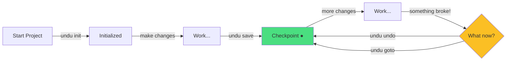
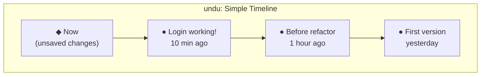
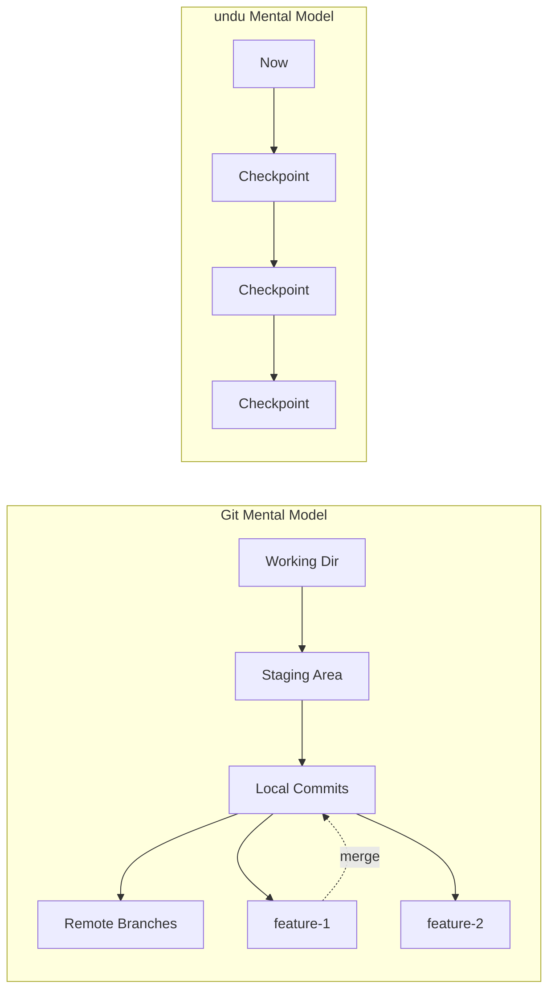
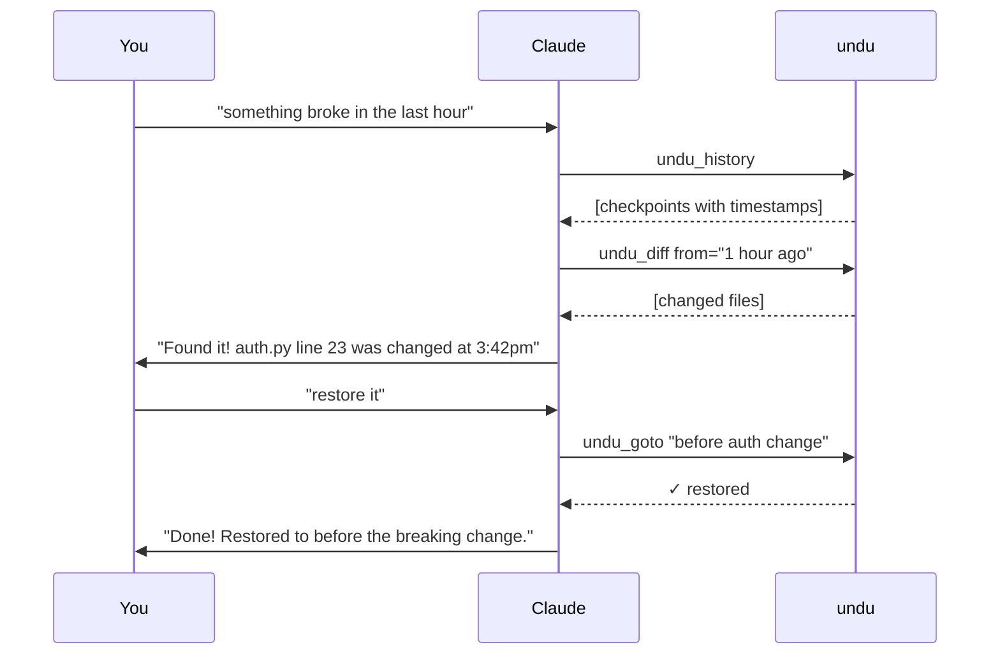
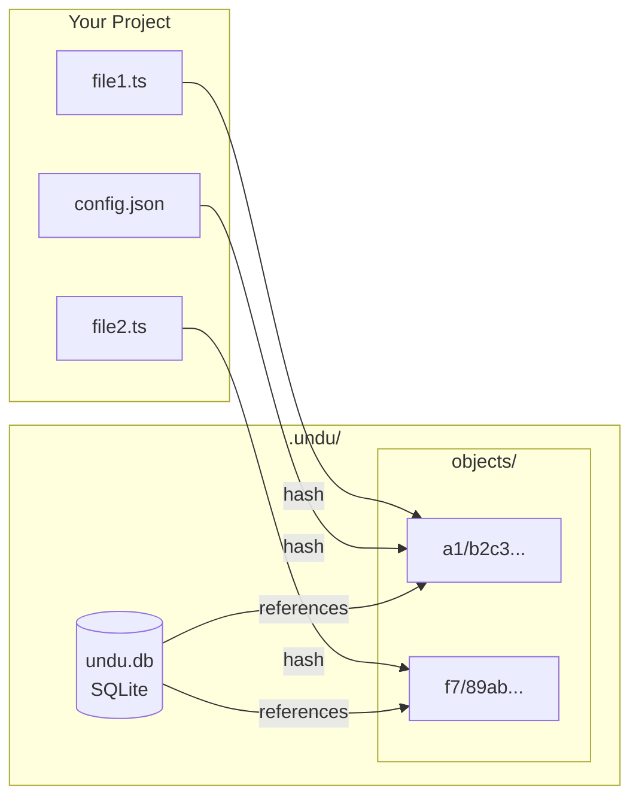

# undu

> **Early alpha** — functional but not production ready. [Feedback welcome!](https://github.com/bdekraker/undu/issues)

**Simple version control for humans.** Undo anything.

```bash
undu save "login working"    # Save your work
undu undo                    # Go back one step
undu history                 # See your timeline
```

No staging. No branches. No merge conflicts. Just save and undo.

## Why undu?

Git is powerful but complex. It was designed for coordinating thousands of Linux kernel developers. Most of us just want to:

- Save our work
- Undo mistakes
- See what changed

undu does exactly that. Nothing more, nothing less.

## Installation

### Standalone Binary (Recommended)

Download the latest release from [GitHub Releases](https://github.com/bdekraker/undu/releases) and add to your PATH.

### npm

```bash
npm install -g undu
```

### From Source

```bash
git clone https://github.com/bdekraker/undu.git
cd undu
bun install
bun run build
# Binary at dist/undu.exe (Windows) or dist/undu (Linux/Mac)
```

## Quick Start



```bash
# Initialize in your project
cd my-project
undu init

# Make some changes, then save
undu save "added user authentication"

# See your timeline
undu history

# Something broke? Go back
undu undo

# Jump to a specific checkpoint
undu goto "added user authentication"
```

## Commands

| Command | Alias | Description |
|---------|-------|-------------|
| `undu` | | Show status (default) |
| `undu init` | `undu i` | Initialize repository |
| `undu save "msg"` | `undu s "msg"` | Create checkpoint |
| `undu undo [n]` | `undu u [n]` | Go back n steps |
| `undu goto "name"` | `undu g "name"` | Jump to checkpoint |
| `undu history` | `undu h` | Show timeline |
| `undu diff` | `undu d` | Show changes |
| `undu peek "name"` | `undu p "name"` | Preview checkpoint |

## The Mental Model

Forget branches and staging areas. undu has just one concept: **a timeline**.



**That's it.** Save checkpoints. Go back when needed.

### Git vs undu



## AI Integration (MCP)

undu includes an MCP server for Claude Code integration. Claude can directly interact with your timeline:



### Setup MCP Server

Add to your Claude Code MCP settings:

```json
{
  "mcpServers": {
    "undu": {
      "command": "bun",
      "args": ["run", "D:/Dev/Projects/Random/undu/src/mcp/server.ts"]
    }
  }
}
```

## Options

```bash
--json    Output as JSON (for scripts/AI)
--help    Show help
--version Show version
```

## How It Works



**Storage:**
```
.undu/
├── undu.db      # SQLite database (metadata, timeline)
├── objects/     # Content-addressed file storage
└── config.toml  # Settings
```

- **Content-addressed storage**: Same file = stored once (automatic deduplication)
- **SQLite**: Fast queries, single portable file
- **Zero dependencies**: Pure Bun/TypeScript

## Ignored Files

By default, undu ignores:
- `.git`, `.undu`, `node_modules`
- `dist`, `build`, `.next`, `.cache`
- `.env`, `.env.local`
- `*.pyc`, `__pycache__`, `*.log`

Edit `.undu/config.toml` to customize.

## Comparison

| Task | Git | undu |
|------|-----|------|
| Save work | `git add -A && git commit -m "..."` | `undu save "..."` |
| Go back | `git checkout HEAD~3` | `undu undo 3` |
| See history | `git log --oneline` | `undu history` |
| Undo one file | `git checkout -- file.py` | `undu undo --file file.py` |
| What changed? | `git diff HEAD~1` | `undu diff` |

## Roadmap

- [ ] Auto-save daemon (background file watching)
- [ ] Cloud sync
- [ ] VS Code extension
- [ ] Natural language commands ("go back to when tests passed")
- [ ] Parallel timelines (branch-like behavior)

## License

MIT

## Author

Benjamin DeKraker ([@bdekraker](https://github.com/bdekraker))

---

*Built for humans who just want to code.*
